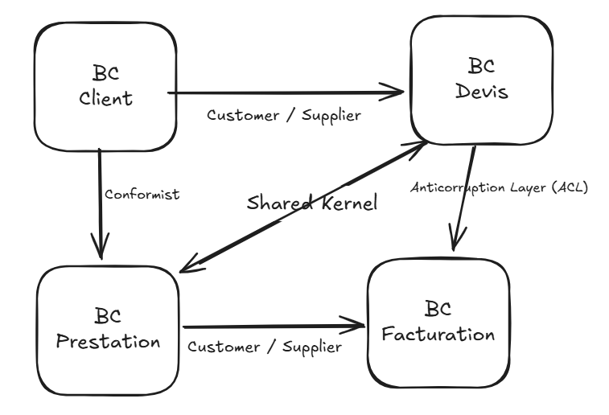

# Context Map — Tableau des Liens & Justifications  
*Auteurs : Romain SCIANDRA & Omar MOSTAFA*  

---

## Tableau des relations entre contextes

| **Contexte source** | **Contexte cible** | **Pattern DDD** | **Nature du lien** | **Justification / Détails d’interaction** |
|:---------------------|:-------------------|:----------------|:-------------------|:------------------------------------------|
| **Clients** | **Devis** | *Customer / Supplier* | Le contexte Devis dépend des données du contexte Clients. | Le professionnel (B2B) crée un devis à partir des informations du client final (B2C). Le client agit comme *Supplier* d’informations d’identité (nom, adresse, contact) pour le contexte Devis. |
| **Devis** | **Prestations** | *Shared Kernel* | Les deux contextes partagent une partie du modèle métier (identifiant du devis, informations sur la prestation, statut). | Lorsqu’un devis est accepté (`DevisAccepté`), il déclenche un événement `PrestationDemandée`. Les champs communs comme `devis_id`, `montant_HT`, `TVA` sont utilisés par les deux contextes. |
| **Prestations** | **Facturation** | *Customer / Supplier* | Le contexte Facturation dépend du statut des prestations. | Une facture est générée uniquement après la réalisation d’une prestation (`PrestationRéalisée`). Le montant et le client proviennent du contexte Prestations. |
| **Devis** | **Facturation** | *Anticorruption Layer (ACL)* | Le contexte Facturation traduit le modèle du Devis pour le rendre compatible avec ses propres règles. | Le devis transformé (`is_transfo = true`) devient une facture. L’ACL évite la dépendance directe aux changements du modèle de Devis. |
| **Clients** | **Prestations** | *Conformist* | Le contexte Prestations s’aligne sur la structure du modèle Client. | Les données clients (nom, adresse, disponibilité) sont reprises sans modification par le contexte Prestations. Aucun modèle propre n’est redéfini. |
 

---

## Schéma Context Map

  

